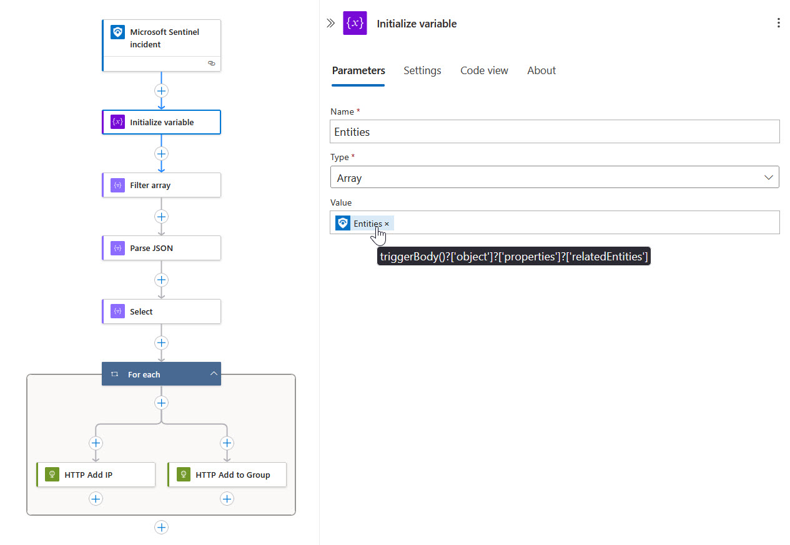
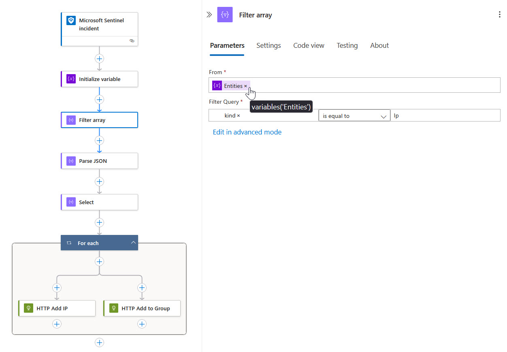
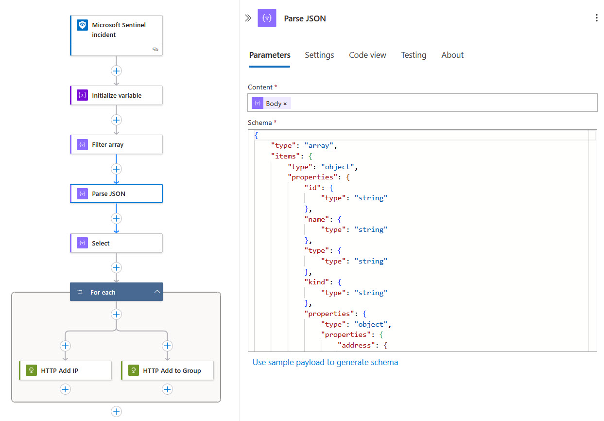
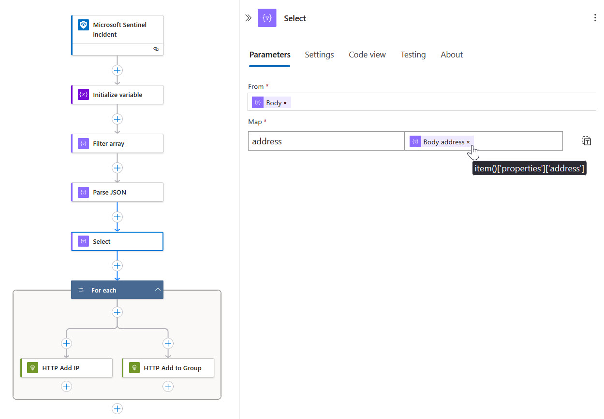
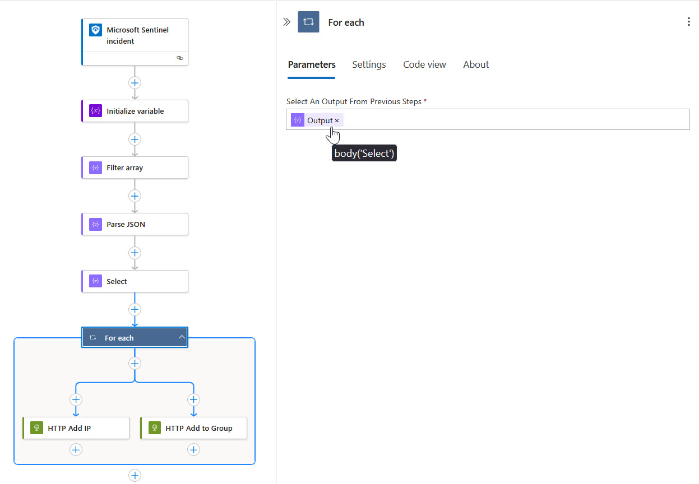
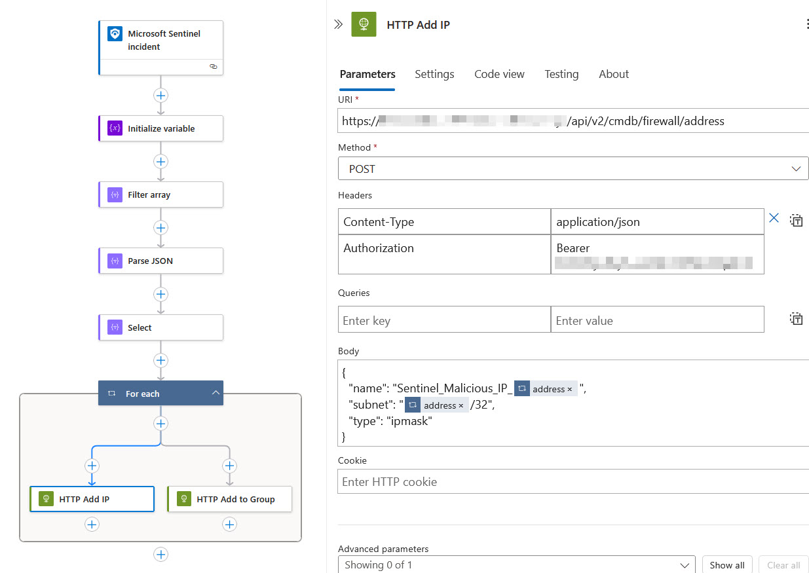
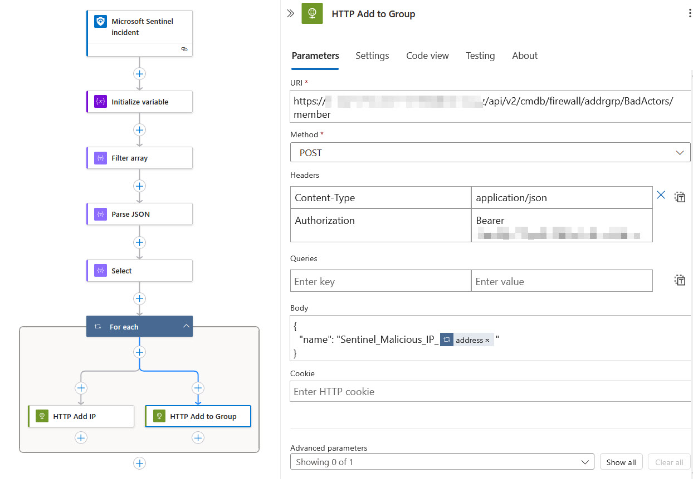

# Playbook to Add Malicious IP Addresses from Incident Entities to FortGate Firewall.
This readme document provides step-by-step instructions on how to add malicious IP addresses to FortiGate firewall, then put those IP addresses into an Address Group for FortiGate to apply policies to.

## Developed by 
* Naveen Kishore
* Sydney John Dsouza
* Vestal Michael
* Dinesh Kumar

## Prerequisites
1. Fortigate firewall is already configured with publically routable and SSL enabled URL.This URL will be used to send HTTP requests from Azure Logic app.
2. Make sure you a bearer token from an Administrator account created with right permissions assigned to it on Fortigate firewall.
3. Create a group / folder on FortiGate firewall under Policy & Objects --> Addresses.

[!IMPORTANT] You will end up with the error if your FortiGate URL uses Public IP rather than domain name that with SSL certificate attached to it.  
Error Message - "**Http request failed as there is an error: 'The SSL connection could not be established, see inner exception.'.**"

## Deploy Azure Logic App

If you want to deploy this app to your Azure tenant, just click the below button.

## Description of Actions Used in this Logic App
- **Microsoft Sentinel Incident** action uses an API connection to connect to your Sentinel Log Analytics Workspace when you manually trigger this playbook for an incident.
    
  

- **Initialize Variable** action is used here to capture all kinds of entities information from the incident where you have triggered this playbook.

  

- **Filter Array** action will filter only the entities of kind **IP Addresses** from the above action.

  

- **Parse JSON** will convert raw output from above action into a structured JSON format, so that it will be each to pick required property of the object (IP address) we need.

  

- **Select** action is used to create a new array by selecting specific properties from an existing array in previous step, thus allowing us to transform and extract data efficiently.
    
  

- **For Each** loop's usage here is obivious, we use this action to loop through each IP in case the incident has multiple IP address entities.

  

- **HTTP - Add IP** action is used to add IP addresses found in Sentinel Incident Entities to your FortiGate firewall by using HTTP POST method available via FortiGate API.

  

- **HTTP - Add IP to Group**, this is again another HTTP POST action that is used to connect to your FortiGate group members list then amend the membership with new members while keeping the existing members. Your firewall admin can then apply policies to this group.

 
